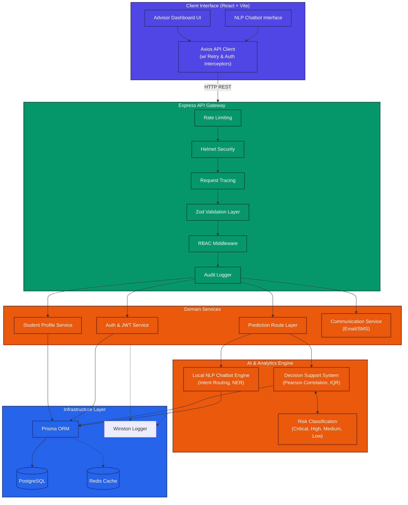
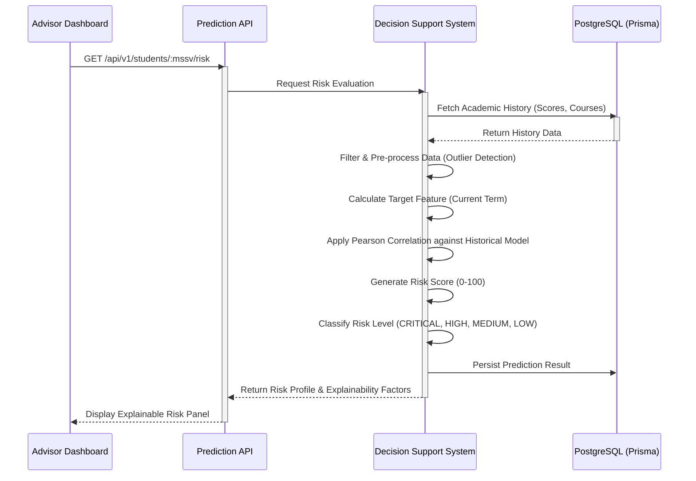
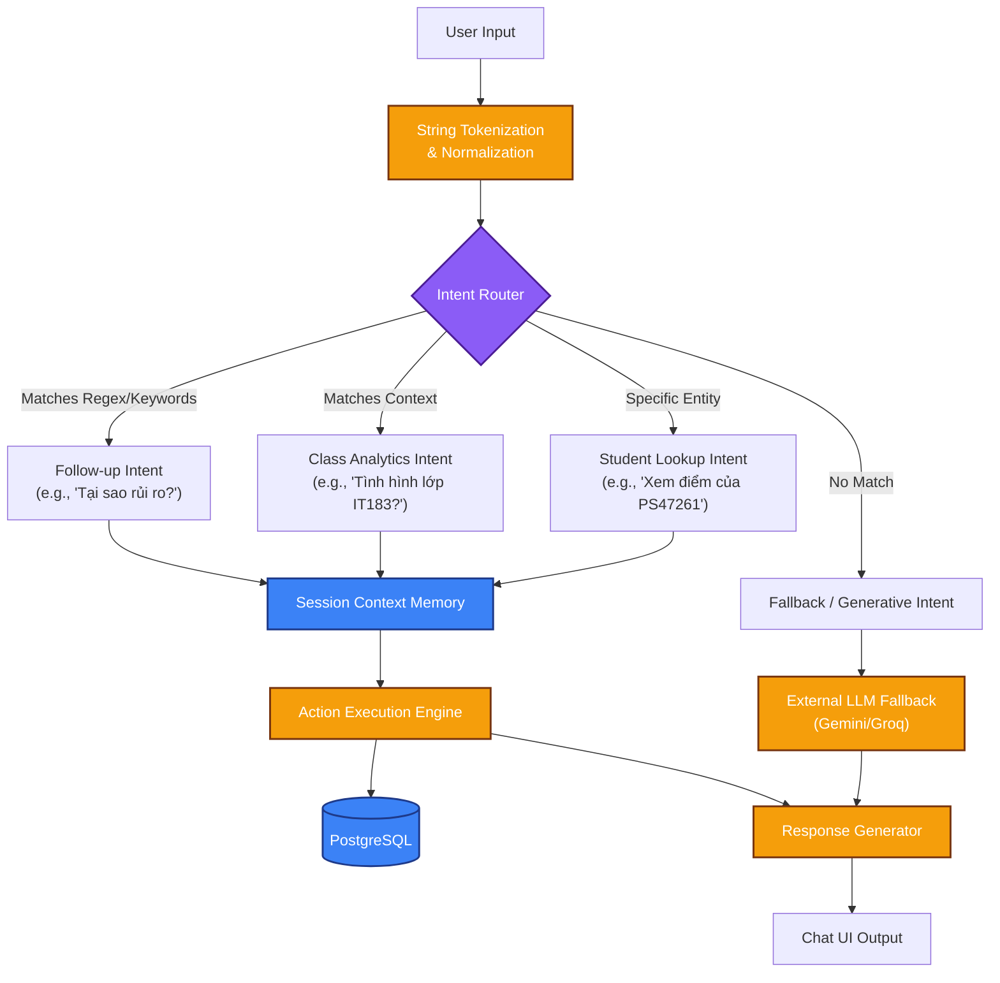

# EduGuard AI — Architecture Diagrams

This document contains visual representations of the system architecture, data flows, and security models for EduGuard AI. These diagrams are designed for technical pitches and architectural reviews.

## 1. System Architecture Diagram

Provides a high-level overview of the entire EduGuard AI ecosystem, illustrating the separation of concerns between the client, API gateway, core services, AI engine, and infrastructure.



## 2. Data Flow Diagram (Prediction & Analytics)

Illustrates how academic data flows into the system and is processed by the AI engine to generate risk profiles.



## 3. NLP Chatbot Flow (Zero-API Cost Local NLP)

Highlights the efficient, local Natural Language Processing pipeline that doesn't rely on expensive external APIs (like OpenAI) for basic intents.



## 4. RBAC & Request Lifecycle

Shows the journey of an HTTP request through the Enterprise middleware stack.

```mermaid
sequenceDiagram
    participant Client
    participant Limit as Rate Limiter
    participant Sec as Security (Helmet/CORS)
    participant Auth as JWT Auth
    participant RBAC as Role Guard
    participant Zod as Validation
    participant Ctrl as Controller
    participant Audit as Audit Logger
    
    Client->>Limit: HTTP Request
    Limit->>Limit: Check Quota
    
    alt Rate Limit Exceeded
        Limit-->>Client: 429 Too Many Requests
    else Within Quota
        Limit->>Sec: Pass Request
        Sec->>Auth: Verify Headers
        
        Auth->>Auth: Verify JWT Signature
        alt Invalid JWT
            Auth-->>Client: 401 Unauthorized
        else Valid JWT
            Auth->>RBAC: Attach req.user
            RBAC->>RBAC: Check req.user.role vs Required Role
            
            alt Role Denied
                RBAC-->>Client: 403 Forbidden
            else Role Approved
                RBAC->>Zod: Pass Request
                Zod->>Zod: Validate req.body/params/query
                
                alt Validation Failed
                    Zod-->>Client: 400 Bad Request (Field Details)
                else Validation Passed
                    Zod->>Ctrl: Execute Business Logic
                    Ctrl-->>Client: 200 OK
                    
                    %% Audit Log happens AFTER response is sent
                    Ctrl-xAudit: Response Finished Event
                    Audit->>Audit: Write Structured Log (Actor, Action, Target)
                end
            end
        end
    end
