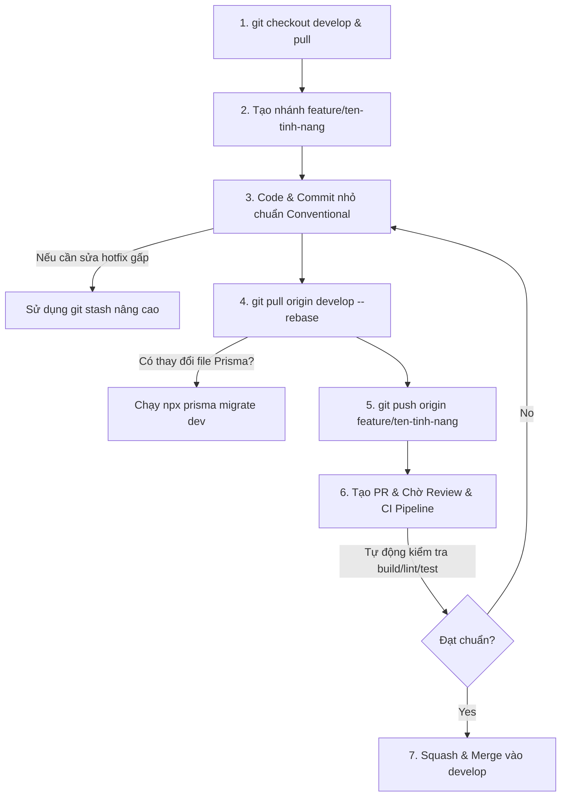

# 👥 Hướng Dẫn Đóng Góp & Quy Trình Git Đồng Đội (EduGuard AI Enterprise)

Chào mừng bạn đến với đội ngũ phát triển dự án **EduGuard AI**! Để đảm bảo mã nguồn luôn ổn định, sạch sẽ và không xảy ra xung đột (conflict) giữa các thành viên khi làm việc nhóm, toàn bộ lập trình viên **bắt buộc** phải tuân thủ nghiêm ngặt quy trình Git dưới đây.

---

## 📌 Sơ Đồ Quy Trình Git (GitHub Flow chuẩn Enterprise)



---

## 🛠️ Quy Trình Làm Việc Chi Tiết (7 Bước Sống Còn)

### 1. Đồng bộ nhánh gốc (Base Branch)
Trước khi bắt đầu code bất kỳ tính năng mới nào, bạn phải đảm bảo code dưới máy mình là mới nhất và đồng bộ với team.
```bash
git checkout develop
git pull origin develop
```
> [!NOTE]
> Việc này giúp bạn lấy toàn bộ logic mới nhất mà các thành viên khác vừa hoàn thành. Base code càng mới, rủi ro conflict khi ghép code sau này càng thấp.

---

### 2. Tạo nhánh tính năng riêng (Feature Branch)
Tuyệt đối không được code trực tiếp trên nhánh `develop` hoặc `main`.
```bash
git checkout -b feature/ten-tinh-nang
# Ví dụ: git checkout -b feature/login-page
```
*   **Quy ước đặt tên nhánh:**
    *   `feature/ten-tinh-nang` (Cho tính năng mới)
    *   `bugfix/ten-loi` (Sửa lỗi thông thường)
    *   `hotfix/loi-nghiem-trong` (Sửa lỗi khẩn cấp trên Production)
    *   `docs/ten-tai-lieu` (Cập nhật tài liệu, README)

---

### 3. Code và Commit nhỏ chuẩn Conventional Commit (Local)
Hãy thường xuyên commit những thay đổi nhỏ và ghi chú rõ ràng. Tránh dồn hàng nghìn dòng code vào 1 commit khổng lồ.
```bash
git add .
git commit -m "feat: thêm giao diện đăng nhập cho giảng viên"
```

> [!TIP]
> **Quy ước đặt tên Commit (Conventional Commits):**
> - `feat:` (Tính năng mới - ví dụ: `feat: add AI prediction pipeline`)
> - `fix:` (Sửa lỗi - ví dụ: `fix: resolve prisma relation bug`)
> - `style:` (Sửa giao diện, format CSS, không đổi logic code)
> - `refactor:` (Tối ưu hóa cấu trúc code cũ nhưng không đổi tính năng)
> - `docs:` (Cập nhật tài liệu, hướng dẫn)
> - `test:` (Viết thêm file Unit Test)
> - `chore:` (Cập nhật thư viện, thay đổi cấu hình dự án)

---

### 4. Tích hợp thay đổi mới từ team & Xử lý rủi ro
Trong lúc bạn đang code, đồng nghiệp có thể đã hoàn thành việc khác và merge vào `develop`. Bạn cần kéo code mới của họ về và giải quyết xung đột (conflict) ngay dưới máy local.

```bash
# Sử dụng rebase để giữ lịch sử commit thẳng, sạch đẹp
git pull origin develop --rebase
```

#### 🚨 Quy tắc đồng bộ Database (Prisma Migrations)
Đối với các dự án sử dụng ORM như Prisma, tuyệt đối **không sử dụng `prisma db push`** trong môi trường phát triển nhóm lớn vì nó sẽ ghi đè trực tiếp cấu trúc DB và dễ làm mất dữ liệu. Thay vào đó hãy dùng **Prisma Migrations**:

*   **Nếu bạn là người thay đổi Database:**
    ```bash
    npx prisma migrate dev --name add_phone_column
    # commit cả thư mục prisma/migrations/ lên Git
    ```
*   **Nếu đồng nghiệp thay đổi Database và bạn vừa pull về:**
    ```bash
    npx prisma migrate dev
    # Lệnh này sẽ tự động áp dụng các cập nhật database mới mà đồng nghiệp viết vào DB local của bạn
    ```

---

### 5. Đẩy nhánh tính năng lên Remote (GitHub)
```bash
git push origin feature/ten-tinh-nang
```

---

### 6. Tạo Pull Request (PR) & Chạy CI Pipeline
1. Truy cập vào kho lưu trữ GitHub của dự án.
2. Bạn sẽ thấy thông báo gợi ý tạo PR từ nhánh bạn vừa push lên. Hãy nhấn **Compare & pull request**.
3. Chỉ định merge vào nhánh **`develop`**.
4. Gắn thẻ (Assignee) đồng nghiệp hoặc Tech Lead vào để **Review code**.

> [!IMPORTANT]
> Đây là chốt chặn an toàn nhất. Code của bạn phải được ít nhất 1 thành viên khác đọc, duyệt (Approve) và hệ thống kiểm tra tự động **CI Pipeline (GitHub Actions)** báo thành công thì mới được phép merge vào hệ thống chung.

---

### 7. Squash & Merge và Xóa nhánh rác
1. Sau khi PR được duyệt và CI chạy thành công, nhấn vào nút mũi tên cạnh chữ Merge và chọn **Squash and merge**.
2. Nhấn **Delete branch** để xóa nhánh rác trên GitHub.
3. Ở máy cá nhân của bạn, dọn dẹp các nhánh cũ để giữ ổ đĩa gọn gàng:
   ```bash
   git checkout develop
   git pull origin develop
   git branch -d feature/ten-tinh-nang
   ```

---

## 🔥 Bí Kíp Git Thực Chiến Cho Coder Xịn

### 1. 🗃️ Tạm cất code dang dở (`git stash`) nâng cao
Khi bạn đang code dở ở nhánh `feature/A` mà phải chuyển nhánh gấp để sửa lỗi (chưa muốn commit code lỗi):
```bash
# Cất code dở kèm lời nhắn mô tả
git stash push -m "dang lam do giao dien dashboard"

# Xem danh sách các stash đang có
git stash list

# Lấy lại stash cụ thể để tiếp tục code (ví dụ stash mới nhất là stash@{0})
git stash apply stash@{0}
# Hoặc lấy ra đồng thời xóa khỏi danh sách lưu trữ:
git stash pop
```

### 2. 🛡️ Thiết lập Branch Protection Rules nâng cao (Trên GitHub)
Để biến dự án thành chuẩn doanh nghiệp lớn, Tech Lead nên bật các cấu hình sau trên GitHub:
*   **Require conversation resolution before merging:** Bắt buộc tất cả các bình luận góp ý (comment review) của đồng nghiệp phải được giải quyết (Resolve) mới cho merge.
*   **Require linear history:** Ép buộc các thành viên phải dùng `git pull --rebase` thay vì merge thông thường, giữ cho sơ đồ commit luôn thẳng hàng.
*   **Restrict who can push:** Chỉ cho phép Tech Lead/PM được push trực tiếp lên nhánh `main` để làm bản phát hành (Release).

---

## 🤖 Quản Trị Hệ Thống & Tự Động Hóa (Enterprise DevOps)

### A. Phân quyền duyệt code (`CODEOWNERS`)
Tạo file `.github/CODEOWNERS` trong dự án để tự động chỉ định người chịu trách nhiệm review các phần code khác nhau:
```text
# Tự động gán @trung review mọi thay đổi trong thư mục client
/client/ @trung

# Tự động gán @vu review mọi thay đổi liên quan đến backend và database
/server/ @vu
/prisma/ @vu
```

### B. CI Pipeline tự động kiểm tra code (`.github/workflows/ci.yml`)
Hệ thống sẽ tự động chạy pipeline kiểm thử này mỗi khi có ai tạo PR gửi vào nhánh `develop`:
```yaml
name: CI Pipeline

on:
  pull_request:
    branches:
      - develop

jobs:
  build:
    runs-on: ubuntu-latest

    steps:
      - name: Checkout code
        uses: actions/checkout@v4

      - name: Setup Node.js
        uses: actions/setup-node@v4
        with:
          node-version: 20

      - name: Install packages
        run: npm install

      - name: Run ESLint (Lint check)
        run: npm run lint --if-present

      - name: Run Build Check
        run: npm run build --if-present
```

### C. Sử dụng Husky + lint-staged (Ngăn chặn commit xấu dưới máy local)
Cài đặt Husky để tự động format code (Prettier) và kiểm tra lỗi cú pháp (ESLint) trước khi lập trình viên nhấn nút commit:
```bash
npm install husky lint-staged --save-dev
npx husky init
```

### D. Semantic Versioning (Định danh phiên bản phần mềm)
Quản lý các cột mốc phát hành sản phẩm theo quy chuẩn `vMAJOR.MINOR.PATCH`:
- `v1.0.0` (Bản phát hành đầu tiên thành công)
- `v1.1.0` (Thêm tính năng mới không gây lỗi tính năng cũ - Minor)
- `v1.0.1` (Sửa lỗi nhỏ - Patch)
- `v2.0.0` (Nâng cấp lớn, thay đổi hoàn toàn kiến trúc - Major)

---

## 🎯 Bài Tập Thực Chiến Dành Cho Thành Viên Mới (Onboarding Task)
Để thành viên mới làm quen với quy trình Git này, hãy cho họ thực hiện thử thách sau:
1. Bật **Branch Protection Rules** cho nhánh `develop`.
2. Tạo nhánh `feature/dummy-test` từ `develop`.
3. Sửa 1 dòng code đơn giản nhưng **cố tình làm lỗi cú pháp**.
4. Push nhánh lên và tạo **Pull Request** vào `develop`.
5. Quan sát xem **CI Pipeline** phát hiện lỗi build, báo đỏ và **khóa không cho merge** như thế nào.
6. Tiến hành sửa lại lỗi, đẩy lên lại và thực hiện **Squash and Merge** sau khi CI chuyển màu xanh.

---

## 🚀 Lộ Trình Nâng Cấp Hệ Thống Trong Tương Lai
Nếu muốn phát triển dự án này từ "Đồ án xuất sắc" thành một sản phẩm khởi nghiệp (Startup/SaaS) thực thụ, team nên triển khai các bước sau:
1. **Docker hóa dự án:** Viết file `Dockerfile` và `docker-compose.yml` để đóng gói toàn bộ server + DB vào container, chạy trên mọi VPS chỉ bằng 1 lệnh.
2. **Auto-Deployment:** Kết nối GitHub với **Vercel** (cho Frontend) và **Render / Railway** (cho Backend) để tự động deploy bản live mỗi khi merge PR.
3. **Giám sát & Tracking lỗi:** Tích hợp **Sentry** để tự động gửi thông báo về Telegram/Email mỗi khi người dùng gặp lỗi runtime trên web.
4. **AI Pipeline Versioning:** Sử dụng các công cụ tracking bộ dữ liệu huấn luyện (như DVC) để quản lý lịch sử các phiên bản mô hình AI (Model Registry).

---
*Hãy cùng nhau xây dựng EduGuard AI với phong cách chuyên nghiệp nhất! Chúc các bạn code vui vẻ!*
