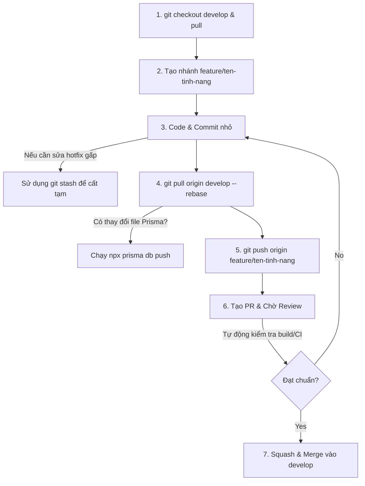

# 👥 Hướng Dẫn Đóng Góp & Quy Trình Git Đồng Đội (EduGuard AI)

Chào mừng bạn đến với đội ngũ phát triển dự án **EduGuard AI**! Để đảm bảo mã nguồn luôn ổn định, sạch sẽ và không xảy ra xung đột (conflict) giữa các thành viên khi làm việc nhóm, toàn bộ lập trình viên **bắt buộc** phải tuân thủ nghiêm ngặt quy trình Git dưới đây.

---

## 📌 Sơ Đồ Quy Trình Git (GitHub Flow chuẩn Enterprise)



---

## 🛠️ Quy Trình Làm Việc Chi Tiết (7 Bước Sống Còn)

### Bước 1: Đồng bộ nhánh gốc (Base Branch)
Trước khi bắt đầu code bất kỳ tính năng mới nào, bạn phải đảm bảo code dưới máy mình là mới nhất và đồng bộ với team.
```bash
git checkout develop
git pull origin develop
```
> [!NOTE]
> Việc này giúp bạn lấy toàn bộ logic mới nhất mà người khác vừa hoàn thành. Base code càng mới, rủi ro conflict khi ghép code sau này càng thấp.

---

### Bước 2: Tạo nhánh tính năng riêng (Feature Branch)
Tuyệt đối không được code trực tiếp trên nhánh `develop` hoặc `main`.
```bash
git checkout -b feature/ten-tinh-nang
# Ví dụ: git checkout -b feature/login-page
```
> [!IMPORTANT]
> Đây là bước cách ly môi trường. Code lỗi ở nhánh tính năng của bạn sẽ hoàn toàn không gây ảnh hưởng đến hệ thống chung.

---

### Bước 3: Code và Commit nhỏ (Local)
Hãy thường xuyên commit những thay đổi nhỏ, tránh dồn hàng nghìn dòng code vào 1 commit khổng lồ.
```bash
git add .
git commit -m "feat: thêm giao diện đăng nhập"
```
> [!TIP]
> Hãy viết lời nhắn commit rõ ràng theo chuẩn **Conventional Commits**:
> - `feat: ...` (Tính năng mới)
> - `fix: ...` (Sửa lỗi)
> - `style: ...` (Sửa CSS, giao diện không đổi logic)
> - `refactor: ...` (Tối ưu hóa code cũ)

---

### Bước 4: Tích hợp thay đổi mới từ team & Xử lý rủi ro
Trong lúc bạn đang code, đồng nghiệp có thể đã hoàn thành việc khác và merge vào `develop`. Bạn cần kéo code mới của họ về và giải quyết xung đột (conflict) ngay dưới máy local của mình.
```bash
# Sử dụng rebase để giữ lịch sử commit thẳng, sạch đẹp
git pull origin develop --rebase
```

#### ⚠️ Quy tắc đồng bộ Database (Prisma)
Nếu sau khi pull về, bạn thấy file cấu hình cơ sở dữ liệu `prisma/schema.prisma` bị thay đổi, bạn **bắt buộc** phải chạy lệnh sau để đồng bộ database local:
```bash
npx prisma db push
```

#### 📦 Mẹo cất code tạm thời (`git stash`)
Nếu bạn đang code dở mà phải chuyển sang nhánh khác gấp để sửa lỗi (chưa muốn commit code lỗi):
```bash
git stash       # Cất code dở đi, nhánh sẽ sạch sẽ
git checkout develop # Chuyển nhánh sửa lỗi...
# Sau khi sửa xong quay lại:
git checkout feature/ten-tinh-nang
git stash pop   # Lấy lại code dở ra làm tiếp
```

---

### Bước 5: Đẩy nhánh tính năng lên Remote (GitHub)
```bash
git push origin feature/ten-tinh-nang
```

---

### Bước 6: Tạo Pull Request (PR) & Code Review
1. Truy cập vào kho lưu trữ GitHub của dự án.
2. Bạn sẽ thấy thông báo gợi ý tạo PR từ nhánh bạn vừa push lên. Hãy nhấn **Compare & pull request**.
3. Chỉ định merge vào nhánh **`develop`**.
4. Gắn thẻ (Assignee) đồng nghiệp hoặc Tech Lead vào để **Review code**.

> [!IMPORTANT]
> Đây là chốt chặn an toàn nhất. Code của bạn phải được ít nhất 1 thành viên khác đọc, duyệt (Approve) thì mới được phép merge vào hệ thống chung.

---

### Bước 7: Squash & Merge và Xóa nhánh
1. Sau khi PR được duyệt, nhấn vào nút mũi tên cạnh chữ Merge và chọn **Squash and merge**.
2. Nhấn **Delete branch** để xóa nhánh rác trên GitHub.
3. Ở máy cá nhân của bạn, dọn dẹp các nhánh cũ:
   ```bash
   git checkout develop
   git pull origin develop
   git branch -d feature/ten-tinh-nang
   ```

*Chúc các bạn có những giờ phút coding vui vẻ và chuyên nghiệp cùng EduGuard AI!*
