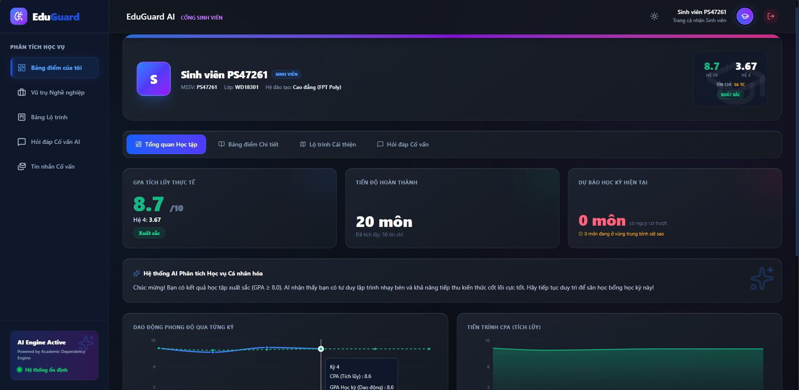
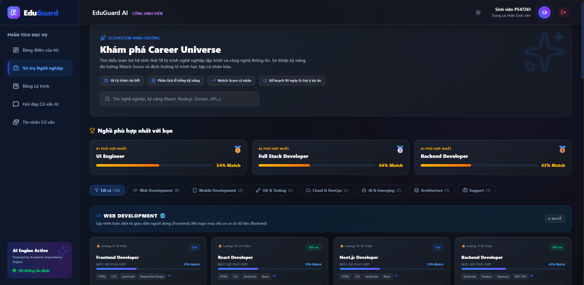
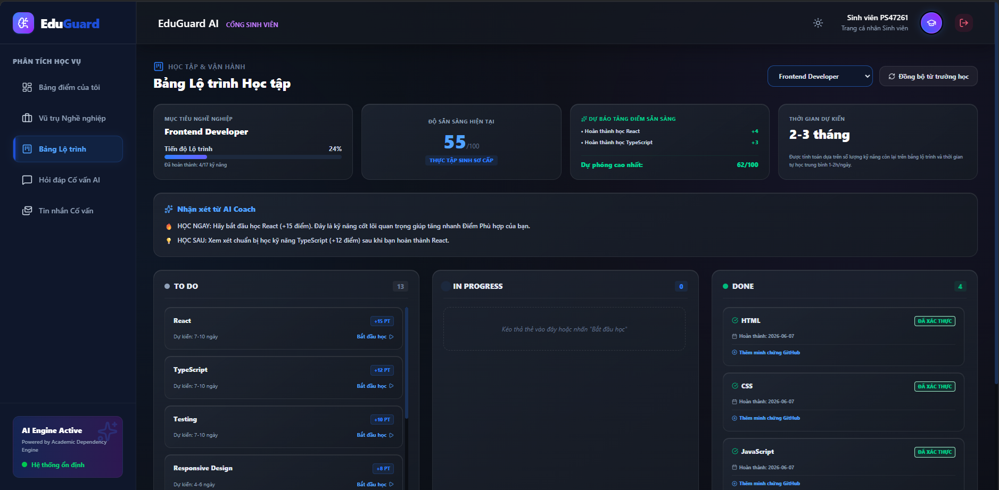
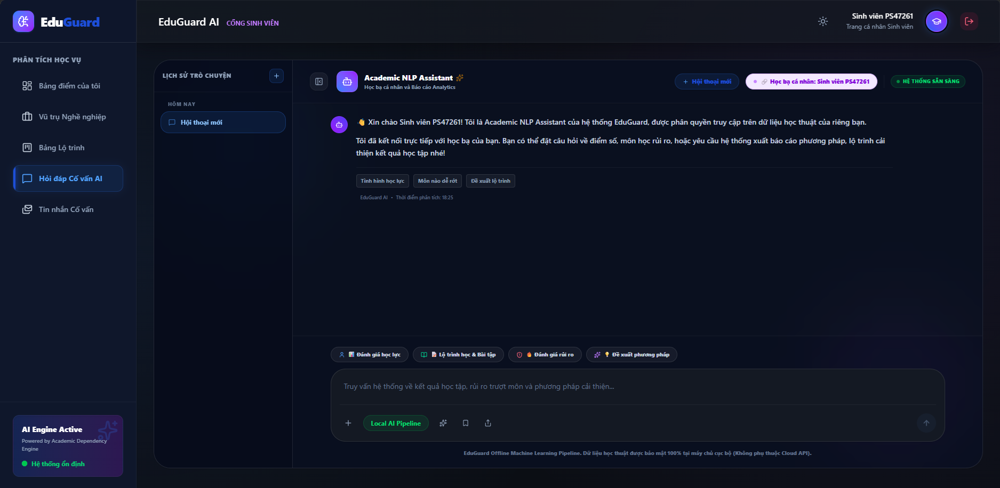

<div align="center">
  

  # EduGuard AI

  AI-Powered Academic Decision Support System

  🏆 Competition Project<br>
  🎯 Student Performance Prediction<br>
  🤖 NLP Academic Assistant<br>
  📊 DSS Dashboard

  [](https://reactjs.org/)
  [](https://nodejs.org/)
  [](https://www.sqlite.org/)
  [](https://www.docker.com/)
  [](https://opensource.org/licenses/MIT)

  *A Competition-ready Academic DSS Prototype.*
</div>

---

## 🚀 1. Quick Start

### Cách 1: Docker (Khuyên dùng — 1 lệnh duy nhất)

Cài [Docker Desktop](https://www.docker.com/products/docker-desktop/) trước, sau đó:

```bash
git clone https://github.com/ntrungz0704/eduguard-ai.git
cd eduguard-ai
docker-compose up -d --build
```

> 👉 **Truy cập `http://localhost:3000`** sau khi build xong (~2-3 phút lần đầu).
> *(Lệnh tắt: `docker-compose down`)*

---

### Cách 2: Chạy thủ công (Dành cho Developer)

**Yêu cầu:** [Node.js LTS ≥ 18](https://nodejs.org/) phải được cài sẵn.

```bash
# 1. Clone dự án
git clone https://github.com/ntrungz0704/eduguard-ai.git
cd eduguard-ai

# 2. Cài thư viện server
npm install

# 3. Setup môi trường + client + database (chạy 1 lần duy nhất)
npm run setup

# 4. Lần đầu: Train AI model + Build UI + Khởi động hệ thống
npm run boot:full
```

> 👉 **Truy cập `http://localhost:5173`** sau khi lệnh cuối chạy xong.
>
> ⚠️ **Lần đầu tiên sau khi đăng nhập:** Vào **Dự đoán & Cảnh báo** → Chọn môn học → Nhấn **Phân tích Rủi ro** để AI chạy thực tế, sau đó Dashboard mới có dữ liệu.

**Lần chạy tiếp theo (không cần train lại):**
```bash
npm run boot
```

---

## 🔐 2. Demo Credentials

Hệ thống đã được thiết lập sẵn tài khoản và dữ liệu (100+ sinh viên, 1000+ bảng điểm) với 3 vai trò rõ rệt:

| Role | Username / Email | Password | Email Suffix |
|------|------------------|----------|--------------|
| 👑 **Admin (Quản trị viên)** | `admin` / `admin@eduguard.ai` | `admin123` | `@eduguard.ai` |
| 👨‍🏫 **Giảng viên (Cố vấn)** | `advisor` / `advisor@eduguard.ai` | `admin123` | `@fpt.edu.vn` |
| 🎓 **Sinh viên** | `PS21034` *(hoặc bất kỳ MSSV hợp lệ)* | `123456` | `@gmail.com` |

---

## 🎥 3. Demo Video
**YouTube:** [EduGuard AI Demo & Pitch Video](https://www.youtube.com/watch?v=_xWiC-XDT6U)

[](https://www.youtube.com/watch?v=_xWiC-XDT6U)

---

## 📸 4. Screenshots

### 1. Đăng nhập hệ thống (Login)


### 2. Dashboard Tổng Quan


### 3. Tra Cứu Sinh Viên (Student Search)


### 4. Mô-đun Dự Báo & Cảnh Báo Nguy Cơ (Prediction)


### 5. Quản Lý Can Thiệp Học Vụ (Intervention)


### 6. AI Assistant (NLP Chatbot)


### 7. Bảng Điểm & Thống Kê (Sinh Viên)


### 8. Vũ Trụ Nghề Nghiệp (Sinh Viên)


### 9. Bảng Lộ Trình Học Tập (Sinh Viên)


### 10. Hỏi Đáp Cố Vấn AI (Sinh Viên)


---

## ❓ 5. Bài toán đặt ra
Các hệ thống quản lý học tập hiện tại chủ yếu chỉ lưu trữ dữ liệu mà thiếu đi các góc nhìn phân tích sâu sắc.

**EduGuard AI giúp:**
- Dự đoán kết quả học tập của sinh viên dựa trên dữ liệu lịch sử.
- Phân tích hồ sơ học vụ và trực quan hóa các rủi ro môn học bị phụ thuộc.
- Cung cấp trợ lý ảo AI hỗ trợ cho Cố vấn học tập.
- Hỗ trợ ra quyết định dựa trên dữ liệu để ngăn ngừa tình trạng bỏ học ngang.

---

## 🌟 6. Core Features
- ✅ **Student Management**: Trực quan hóa dữ liệu sinh viên toàn diện.
- ✅ **GPA Analytics**: Phân tích phổ điểm và theo dõi tiến độ.
- ✅ **Risk Prediction**: Dự báo sớm nguy cơ trượt môn (High, Medium, Low).
- ✅ **NLP Assistant**: Chatbot hỗ trợ cố vấn học tập tra cứu thông tin nhanh.
- ✅ **DSS Dashboard**: Bảng điều khiển ra quyết định chuyên nghiệp.
- ✅ **Academic Recommendations**: Đề xuất can thiệp học vụ kịp thời.
- ✅ **Career Roadmap**: Lộ trình nghề nghiệp với 18 ngành IT, tài nguyên học tập cập nhật.

---

## 🧠 7. AI Components
EduGuard AI tích hợp sâu 3 động cơ lõi:
- **Risk Forecast Engine**: Dự báo nguy cơ trượt môn từ điểm số lịch sử (`TensorFlow.js`).
- **Academic Assistant**: Trợ lý ảo NLP có khả năng hiểu ý định người dùng (`NLP.js`).
- **Knowledge Dependency Graph**: Phát hiện "Lỗ hổng kiến thức dây chuyền" dựa trên tín chỉ tiên quyết.

---

## 🏗️ 8. Architecture
Thiết kế theo chuẩn Modular Monolith, dễ mở rộng.


*(Chi tiết xem thêm tại thư mục `docs/`)*

---

## 💻 9. Tech Stack
| Layer | Technology |
|-------|-----------|
| **Frontend** | React 18, Vite, Recharts, TailwindCSS |
| **Backend** | Node.js 22, Express |
| **Database** | SQLite (Prototype) / PostgreSQL (Production-ready) |
| **AI** | TensorFlow.js (Risk Prediction), Node-NLP (Chatbot) |
| **Auth** | JWT (jsonwebtoken) |
| **DevOps** | Docker, Docker Compose |

---

## 🛠️ 10. Troubleshooting

**Lỗi: Port 3000 hoặc 5173 đang bận (Windows)**
```bash
npm run kill
# Hoặc thủ công:
netstat -ano | findstr :3000
taskkill /F /PID <PID>
```

**Lỗi: `JWT_SECRET` không tìm thấy**
```bash
# Đảm bảo file .env tồn tại:
copy .env.example .env
```

**Lỗi: `Cannot find module '.../generated/prisma'`**
```bash
npx prisma generate
```

**Lỗi: Database trống, không có dữ liệu**
```bash
npx prisma db push
node prisma/seed.js
```

**Yêu cầu phiên bản:**
- Node.js `>= 18` (khuyên dùng 22 LTS)
- npm `>= 9`
- Docker `>= 24` (nếu dùng Docker)

---

## 👥 11. Team EduGuard-AI
- Backend Engineering & DSS Architecture
- Frontend Development & Data Visualization

**Tác giả:**
- Nguyễn Phạm Thành Trung
- Nguyễn Minh Hiếu
- Mai Thị Vỹ An

---

## 🔗 12. Hệ Thống Đồng Bộ Hóa Học Vụ & Tự Động Kết Nối (Cohesive Sync)

Để đảm bảo tính logic và nhất quán giữa các vai trò và giao diện, hệ thống EduGuard AI đã tích hợp cơ chế đồng bộ hóa dữ liệu học vụ thời gian thực:

*   **Tải & Khôi Phục Lịch Sử Chat**: Chatbot tự động truy vấn dữ liệu `ConversationHistory` từ database để nạp lại toàn bộ cuộc hội thoại cũ của sinh viên/giảng viên khi đăng nhập lại hoặc chuyển thiết bị.
*   **Liên Kết Dashboard → Quản Lý Can Thiệp**: Kích hoạt "Can thiệp" từ Dashboard (Tổng quan) sẽ tạo đồng thời `Intervention` và `InterventionRoadmap`, tự động đẩy sinh viên vào danh sách **Theo dõi** (Top 50) trong trang Can thiệp.
*   **Hoàn Tác Đồng Bộ (Undo)**: Khi xóa lộ trình học tập trong trang Can thiệp để chuyển lại về "Nguy hiểm", hệ thống sẽ tự động xóa cắm cờ tương ứng để sinh viên xuất hiện lại trong cảnh báo đỏ của Dashboard.
*   **Đồng Bộ Điểm Số & Trạng Thái Ổn Định**: Khi điểm số thực tế của sinh viên được cập nhật $\ge 5.0$ (Đạt), hệ thống tự động đổi trạng thái can thiệp thành `RESOLVED` và đóng lộ trình `COMPLETED` để đưa sinh viên vào nhóm **Ổn định** (Top 100).
*   **Gửi Lộ Trình Từ AI Chatbot → Tự Động Can Thiệp**: Khi Cố vấn bấm nút "Gửi cho SV" hoặc "Gửi lộ trình đầy đủ" trong Chatbot AI, hệ thống tự động phân tích mã môn học trong tin nhắn để cắm cờ can thiệp mà giảng viên không cần thực hiện thủ công lại ở giao diện khác.

<br>
<div align="center">
  <i>"Explain Risk. Support Students. Improve Outcomes."</i>
</div>
