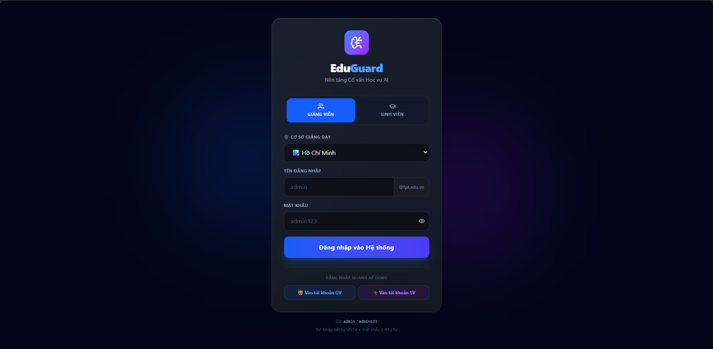
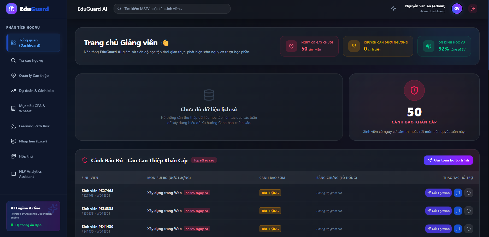
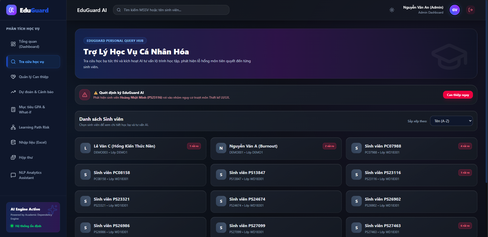
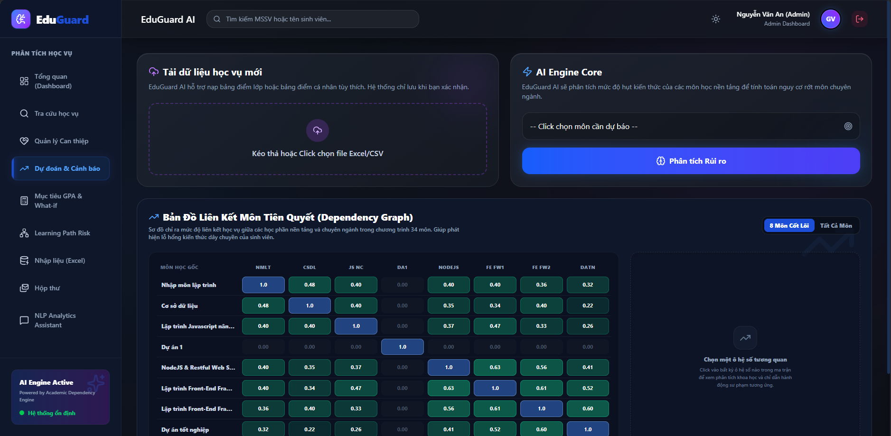
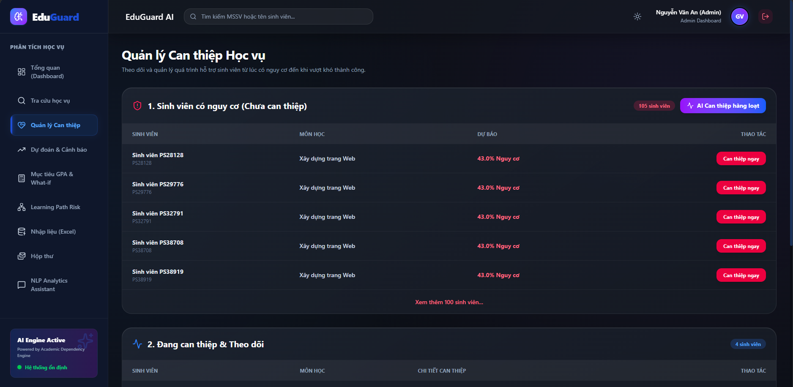
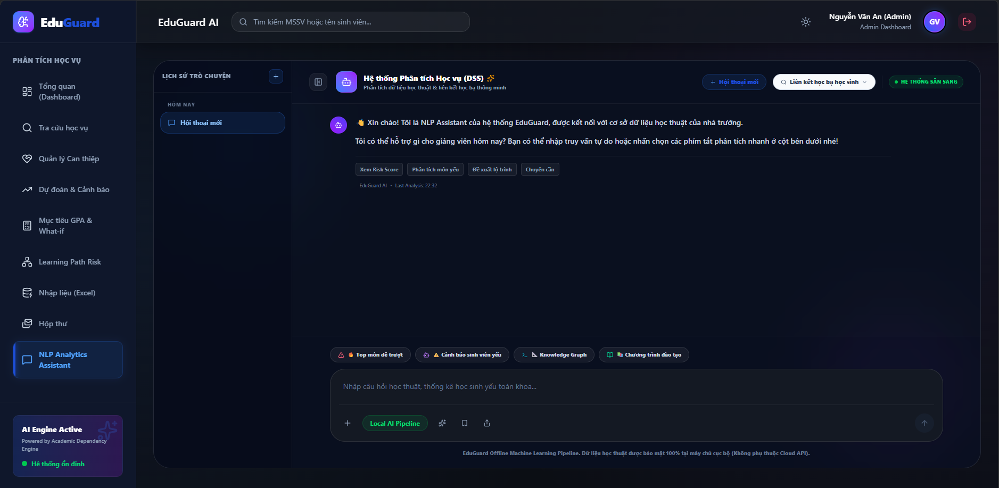

<div align="center">
  

  # EduGuard AI

  AI-Powered Academic Decision Support System

  🏆 Competition Project<br>
  🎯 Student Performance Prediction<br>
  🤖 NLP Academic Assistant<br>
  📊 DSS Dashboard

  [](https://reactjs.org/)
  [](https://nodejs.org/)
  [](https://www.postgresql.org/)
  [](https://www.docker.com/)
  [](https://opensource.org/licenses/MIT)

  *A Competition-ready Academic DSS Prototype.*
</div>

---

## 🚀 1. Quick Start

**Cách 1: Khởi chạy nhanh bằng Docker (Khuyên dùng tuyệt đối cho Ban Giám Khảo)**
Đây là cách an toàn và chuẩn xác nhất để chạy hệ thống AI mà không lo bị lỗi môi trường. Bạn chỉ cần cài đặt Docker Desktop.
- 📥 **Tải Docker Desktop tại đây:** [https://www.docker.com/products/docker-desktop/](https://www.docker.com/products/docker-desktop/)

Sau khi cài đặt xong Docker Desktop, mở Terminal/CMD và chạy:
```bash
git clone https://github.com/ntrungz0704/eduguard-ai.git
cd eduguard-ai
docker-compose up -d --build
```
*(Truy cập `http://localhost:5173` sau khi chạy xong. Mọi dữ liệu mẫu và AI sẽ được tự động khởi tạo chuẩn xác!)*

**Cách 2: Chạy thủ công (Không khuyến khích - Dễ gặp lỗi môi trường)**
Cách này yêu cầu máy tính của bạn phải có Node.js >= 18 và có thể gặp lỗi do thiếu thư viện Python/C++ Build Tools khi biên dịch các thư viện AI (như TensorFlow.js).
```bash
git clone https://github.com/ntrungz0704/eduguard-ai.git
cd eduguard-ai
npm install        # Cài đặt thư viện gốc cho server
npm run setup      # Cài đặt client & Tạo Data mẫu
npm run boot:full  # Train AI & Khởi chạy hệ thống
```

*(Lưu ý: Nếu sử dụng Cách 2, ban đầu Dashboard sẽ hiển thị 0 sinh viên nguy cơ. Bạn cần vào mục **Dự đoán & Cảnh báo** -> Chọn 1 môn học -> Nhấn **Phân tích Rủi ro** để AI chạy model thực tế và trả ra danh sách cảnh báo.)*

---

## 🔐 2. Demo Credentials

Hệ thống đã được thiết lập sẵn tài khoản và dữ liệu (100+ học sinh, 1000+ bảng điểm). 

**Admin**
- **Email:** `admin@eduguard.ai`
- **Password:** `123456`

**Advisor (Cố vấn học tập)**
- **Email:** `advisor@eduguard.ai`
- **Password:** `123456`

---

## 🎥 3. Demo Video
**YouTube:** https://youtube.com/xxxxx

---

## 📸 4. Screenshots

### 1. Đăng nhập hệ thống (Login)


### 2. Dashboard Tổng Quan


### 3. Tra Cứu Sinh Viên (Student Search)


### 4. Mô-đun Dự Báo & Cảnh Báo Nguy Cơ (Prediction)


### 5. Quản Lý Can Thiệp Học Vụ (Intervention)


### 6. AI Assistant (NLP Chatbot)


---

## ❓ 5. Problem Statement
Current academic management systems store data but do not provide intelligent insights. 

**EduGuard AI helps:**
- Predict student performance from historical data.
- Analyze academic records and visualize dependency risks.
- Provide AI-powered consultation for academic advisors.
- Support data-driven decision making to prevent dropouts.

---

## 🌟 6. Core Features
- ✅ **Student Management**: Trực quan hóa dữ liệu sinh viên toàn diện.
- ✅ **GPA Analytics**: Phân tích phổ điểm và theo dõi tiến độ.
- ✅ **Risk Prediction**: Dự báo sớm nguy cơ trượt môn (High, Medium, Low).
- ✅ **NLP Assistant**: Chatbot hỗ trợ cố vấn học tập tra cứu thông tin nhanh.
- ✅ **DSS Dashboard**: Bảng điều khiển ra quyết định chuyên nghiệp.
- ✅ **Academic Recommendations**: Đề xuất can thiệp học vụ kịp thời.

---

## 🧠 7. AI Components
EduGuard AI không chỉ là phần mềm CRUD quản lý thông thường, mà được tích hợp sâu 3 động cơ lõi:
- **Risk Forecast Engine**: Phân tích và dự báo nguy cơ dựa trên điểm số lịch sử (Sử dụng `TensorFlow.js`).
- **Academic Assistant**: Trợ lý ảo NLP có khả năng hiểu ý định (Intent Recognition) của người dùng (Sử dụng `NLP.js`).
- **Knowledge Dependency Graph**: Phát hiện "Lỗ hổng kiến thức dây chuyền" dựa trên cấu trúc tín chỉ tiên quyết (Sử dụng `Graph Traversal Algorithm`).

---

## 🏗️ 8. Architecture
Hệ thống được thiết kế theo chuẩn Modular Monolith minh bạch, dễ dàng mở rộng.


*(Chi tiết xem thêm tại thư mục `docs/`)*

---

## 💻 9. Tech Stack
- **Frontend**: React, TailwindCSS, Recharts
- **Backend**: Node.js, Express
- **Database**: SQLite (cho bản Prototype), PostgreSQL (sẵn sàng cho Production)
- **AI**: TensorFlow.js (Dự báo), Node-NLP (Chatbot)

---

## 🛠️ 10. Troubleshooting (Common Issues)

- **Port 3000/5173 already in use (Lỗi kẹt cổng Windows):**
  ```bash
  taskkill /F /PID <PID_của_tiến_trình>
  ```
- **Node Version Requirement:** Yêu cầu Node.js `>= 18`.
- **Docker Requirement:** Yêu cầu Docker `>= 24`.

---

## 👥 11. Team EduGuard-AI

- **Nguyễn Trung**: Backend Engineering & DSS Architecture
- **Vũ**: Frontend Development & Data Visualization

<br>
<div align="center">
  <i>"Explain Risk. Support Students. Improve Outcomes."</i>
</div>
