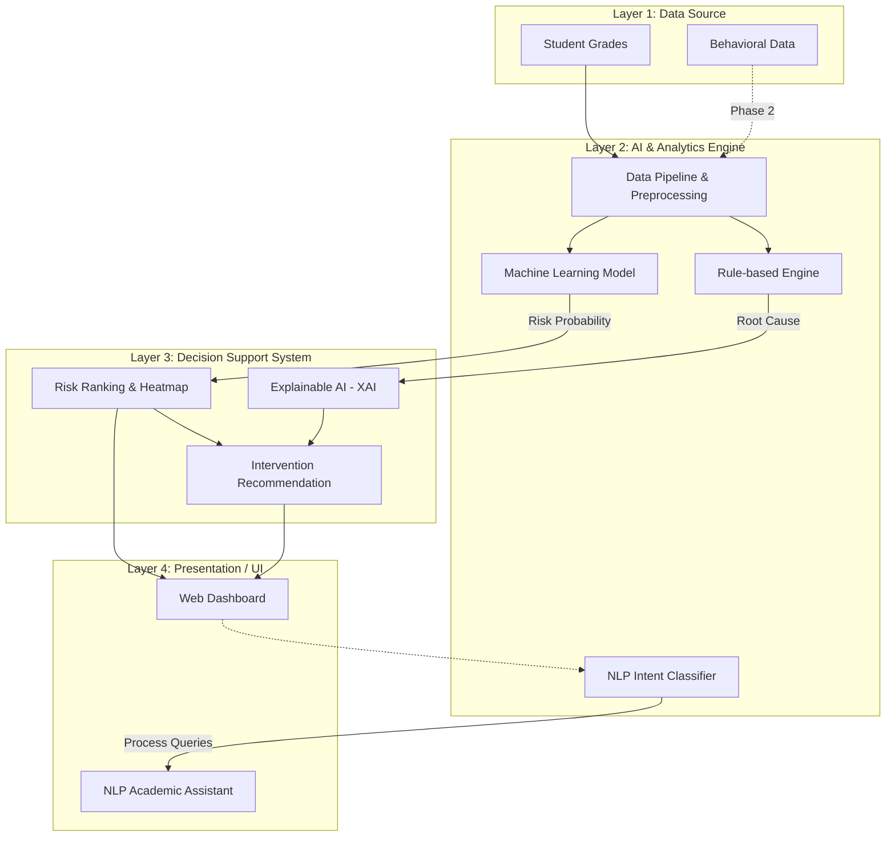

# KIẾN TRÚC HỆ THỐNG EDUGUARD AI DSS

Đây là sơ đồ kiến trúc chuẩn xác nhất để đưa vào Slide. Nó không quá phức tạp (căng não) nhưng đủ thể hiện tư duy hệ thống chuyên nghiệp của nhóm.

### Giải thích cho BGK (Nếu được hỏi về sơ đồ này)
- **Luồng dữ liệu (Data Flow):** Dữ liệu bảng điểm đi vào Data Pipeline để chuẩn hóa. Sau đó được tách làm 2 nhánh: nhánh chạy qua ML để lấy dự báo rủi ro, nhánh chạy qua Rule-based để trích xuất nguyên nhân gốc rễ.
- **Tại sao lại có nét đứt ở Behavioral Data?** Nét đứt thể hiện đây là dữ liệu đang được mô phỏng ở Phase 1 và sẽ được tích hợp thực tế qua API ở Phase 2 (Roadmap).
- **Điểm sáng (Highlight):** Lớp thứ 3 là **Decision Support System**. Đây là nơi hợp nhất kết quả của AI (Con số) và XAI (Lời giải thích) để tạo ra các đề xuất can thiệp cho giao diện người dùng.
