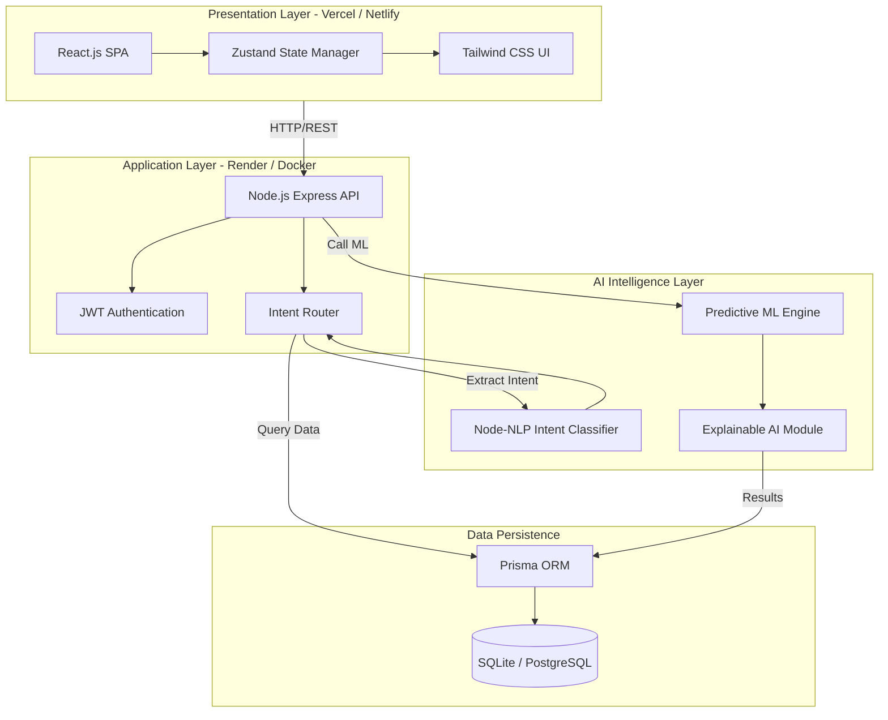
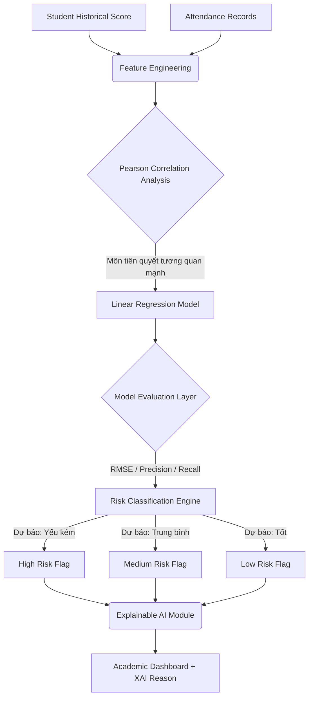
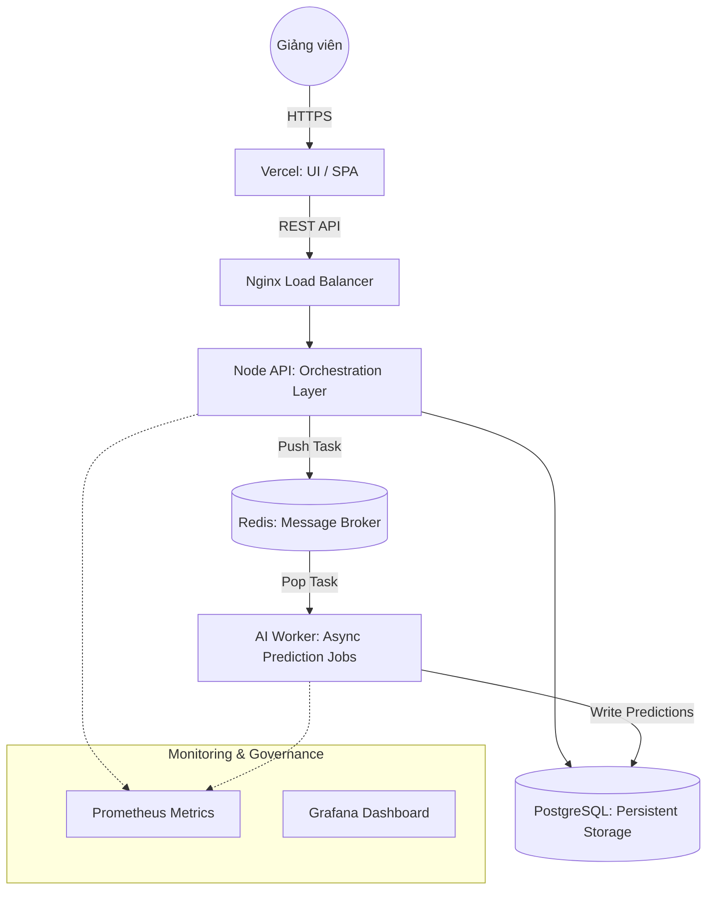
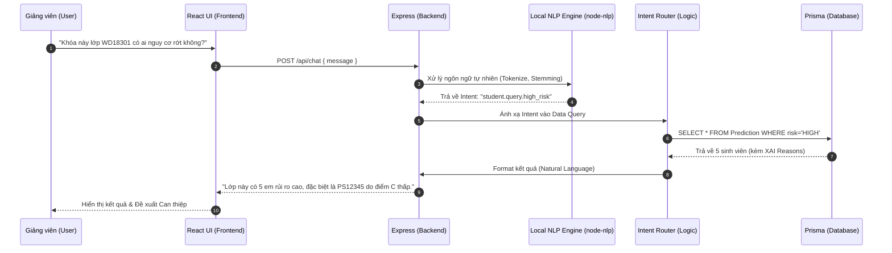
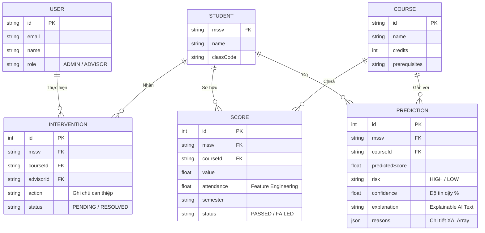

# EduGuard AI - Architecture & Diagrams

Tài liệu này cung cấp cái nhìn tổng quan về Kiến trúc hệ thống, Luồng xử lý AI (AI Pipeline), Luồng ra quyết định (AI Decision Flow) và Mô hình Triển khai (Deployment) của Nền tảng EduGuard AI.

## 1. System Architecture Diagram

Cấu trúc tổng thể của hệ thống tuân theo chuẩn Enterprise, tách bạch Frontend, Backend, AI Workers và Database.

## 2. AI Decision Flow Diagram (Cốt lõi Trí tuệ Nhân tạo)

Mô tả cách dữ liệu thô biến thành một quyết định hành động thông qua hệ thống Học máy, thể hiện tính "AI Systems Engineering" đích thực.

## 3. Deployment Diagram (Enterprise Scalability)

Mô hình triển khai nhắm tới mở rộng hệ thống (Scalability) với Worker độc lập và Hàng đợi (Queue), không bị sập khi phải Training hàng nghìn dữ liệu sinh viên.

## 4. AI Pipeline Sequence Diagram (Local NLP)

Luồng xử lý khi người dùng trò chuyện với hệ thống Chatbot. Mọi xử lý đều được thực hiện 100% Offline (Local AI) để đảm bảo Quyền riêng tư Dữ liệu (Privacy).

## 5. Database ERD (Entity-Relationship Diagram)

Sơ đồ thực thể liên kết (ERD) mô tả cách dữ liệu được tổ chức để phục vụ Predictive Academic Analytics.

